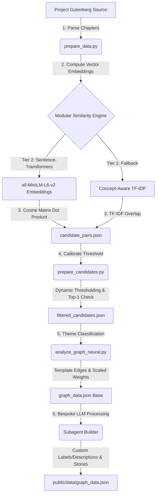

# Meditations Graph - Interactive Semantic Visualizer

This application parses Marcus Aurelius's *Meditations*, constructs a semantic relationship graph of its passages (nodes) and connections (edges) using dense local neural embeddings, and visualizes the resulting graph to reveal linked thoughts and Stoic themes.

---

## 🛠️ Graph Construction Architecture

The graph construction pipeline is structured as a multi-stage data processing pipeline located in the `scripts/` directory:



### Stage 1: Passage Parsing & Text Extraction
Implemented in `scripts/prepare_data.py`.
- **Text Sourcing**: Downloads the plain text George Long translation (1862) of *Meditations* from Project Gutenberg.
- **Section Parsing**: Locates the book headers (`THE FIRST BOOK` to `THE TWELFTH BOOK`) using multi-line regular expressions.
- **Chapter Segmentation**: Identifies passage boundaries by detecting Roman numeral and decimal chapter headers (e.g., `I. `, `1. `, `XX. `).
- **Output**: Produces 437 unique nodes saved in `src/data/raw_meditations.json`, preserving their coordinates (Book number, Chapter number, and raw text).

### Stage 2: Modular Similarity Engine
Implemented in `scripts/prepare_data.py`. Runs a multi-tier similarity model to compute the top $K=5$ nearest neighbors for each of the 437 passages:

#### Tier 2: Local Neural Embeddings (Primary)
- Uses the Hugging Face `all-MiniLM-L6-v2` Sentence-Transformers model running locally on CPU/GPU.
- Converts each passage text into a 384-dimensional dense vector representing its semantic and conceptual meaning.
- Computes pairwise cosine similarity via matrix dot product:
  $$\text{Cosine Similarity}(\mathbf{u}, \mathbf{v}) = \frac{\mathbf{u} \cdot \mathbf{v}}{\|\mathbf{u}\|_2 \|\mathbf{v}\|_2}$$
  Since embeddings are L2-normalized, this simplifies to the dot product of the embedding matrix: $S = E \cdot E^T$.

#### Tier 1: Concept-Aware TF-IDF (Fallback)
- Automatically triggers if `sentence-transformers` is missing.
- **Lexical Refinement**: Discards standard noise stop words but explicitly preserves Stoic-critical terms (e.g. `god`, `law`, `one`, `bad`, `art`, `fit`, `end`, `whole`).
- **Stoic Taxonomy Injection**: Uses a curated dictionary mapping synonyms for 5 Stoic themes:
  - *Inner Citadel* (e.g. "fortress", "ruling center", "opinion", "retreat")
  - *Transience of Life* (e.g. "fleeting", "smoke", "river", "eternity", "oblivion")
  - *Cosmic Order* (e.g. "logos", "nature", "cosmos", "providence")
  - *Social Duty* (e.g. "fellowship", "citizen", "cooperation", "forbear")
  - *Virtue & Vice* (e.g. "justice", "temperance", "fortitude", "integrity")
- Passages matching these terms have special concept tokens (e.g., `__concept_inner_citadel__`) injected into their tokenized lists to artificially boost term frequency similarity.
- Outputs `scripts/candidate_pairs.json` (2,185 pairs).

### Stage 3: Dynamic Thresholding & Calibration
Implemented in `scripts/prepare_candidates.py`.
- **Method Detection**: Inspects the average and maximum similarity scores in the candidate pool. Since neural embeddings have a higher distribution ($0.3 - 0.8$) than TF-IDF ($0.05 - 0.5$), it automatically calibrates the filtering threshold:
  - Average similarity $> 0.35$ $\rightarrow$ **Neural Embeddings** $\rightarrow$ Threshold $= 0.55$.
  - Average similarity $\le 0.35$ $\rightarrow$ **TF-IDF** $\rightarrow$ Threshold $= 0.28$.
- **Orphan Prevention**: Loops over each node and guarantees that its absolute top-1 nearest neighbor is always kept, even if its similarity falls below the threshold.
- Outputs `scripts/filtered_candidates.json` (1,154 connections).

### Stage 4: Dynamic Weight Scaling & Categorization
Implemented in `scripts/analyze_graph_neural.py`.
- **Thematic Tagging**: Classifies all 1,154 candidate links into the 6 Stoic categories using a keyword density scoring system, assigning a baseline label (e.g. "Shields soul from externals") and description.
- **Weight Calibration**: Scales similarity values into integer weights between `30` (weakest connection) and `95` (strongest connection) dynamically using min-max normalization over the active similarity range:
  $$\text{Weight} = 30 + \left( \frac{\text{Similarity} - \text{Min Similarity}}{\text{Max Similarity} - \text{Min Similarity}} \right) \times 65$$

### Stage 5: Bespoke LLM Link Refinement
Executed by the `graph-relationship-builder` subagent.
- **High-Impact Edges**: Isolates the top 100 strongest edges and takeaway links.
- **Deep Philosophical Evaluation**: Reads the actual text of both passages and generates a custom active label (e.g., "The Reserve Clause", "Virtual Material") and a detailed 1-2 sentence description detailing the specific Stoic logic.
- **Storylines**: Structures the 5 global narrative takeaways (The Inner Citadel, The Flow of Time, Harmonizing with the Cosmos, Social Duty and Fellowship, The Vanity of Fame) and links them to central nodes in `public/data/graph_data.json`.

---

## 🚀 Execution Commands

To regenerate the graph data from scratch:

1. **Calculate Embeddings**:
   ```bash
   C:\Users\quinn\AppData\Local\Programs\Python\Python313\python.exe scripts/prepare_data.py
   ```
2. **Filter Candidate Links**:
   ```bash
   C:\Users\quinn\AppData\Local\Programs\Python\Python313\python.exe scripts/prepare_candidates.py
   ```
3. **Classify Base Edges**:
   ```bash
   C:\Users\quinn\AppData\Local\Programs\Python\Python313\python.exe scripts/analyze_graph_neural.py
   ```
4. **Refine with Subagent**:
   Run the subagent inside your agent environment to compile the final `public/data/graph_data.json`.
